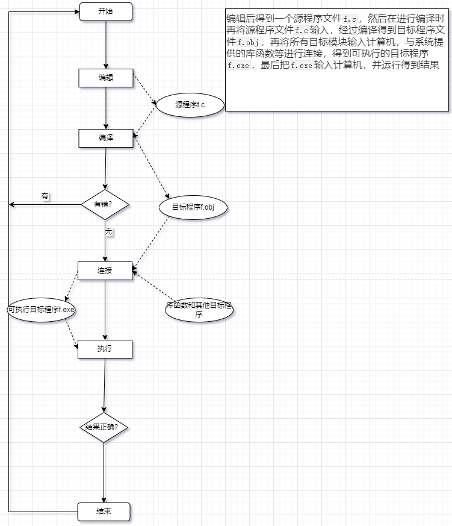

# 第 1 章 程序设计和C语言

## 最简单的c语言程序

```c
#include<stdio.h>           //这是编译预处理指令

int main()                  //定义主函数

//main函数名字，int 函数的类型

//在执行主函数后会得到一个值(即函数值)，其值为int类型

{                          //函数的开始标识

printf(”this is a c program \n”);//标准输出函数

return 0;             //函数执行完毕时返回函数值0

//当main函数执行结束前将整数0作为函数值，返回到调用函数处。

//当主函数正常结束时，得到的函数值为0；异常或错误时，函数值为一个非0的整数。

//这个函数值是返回给调用main函数的操作系统的。

}                         //函数结束标志
```

## C语言程序的结构

一个程序有一个或多个源程序文件组成。

一个源程序可以包含3个部分

1. 预处理指令。`#include<stdio.h>`(还有其他的预处理指令，如`#define`等…)

2. 全局声名：在函数之外进行的函数声明。在整个源程序文件范围内有效。（在函数中声明的变量是局部变量，只能在函数范围内有效。）

3. 函数定义

函数是`C`程序的主要组成部分。

1. 函数是`C`程序的基本单位。

2. 一个`C`语言程序由一个或多个函数组成的，其中必须包含一个`main`函数(且只能有一个`main`函数)。

3. 一个程序包含若干个源程序文件，一个源程序文件包含若干个函数。

4. 一个函数包含两个部分

5. 1. 函数首部：包括函数名、函数类型、函数属性、函数参数（形式参数）名、参数类型

例如：`int max (int x , int y)`

一个函数名后面必须跟一对圆括号，括号内写函数的参数名和类型。如果没有可以写void或者空括号。

`int max(void)`

`and`

`int max()`

1. 函数体：花括号内的部分。如果函数中包含有多层花括号，则最外层的一对花括号是函数体的范围。

2. 函数体包含两部分

3. 1. 声明部分：

   2. 1. 定义在本函数中所用到的变量。`int a,b,c`;
      2. 对本函数所调用函数进行声明。`int max(int       x,int,y);`

   3. 执行部分：由若干语句组成。

声明部分和执行部分可有可无。就是空函数。

1. 程序总是从`main`函数开始执行的，无论`main`函数在什么位置
2. 每个数据声明和语句的最后面必须有一个分号。
3. `C`语言本身不提供输入输出语句。输入和输出的操作是由库函数`scanf`和`printf`等函数来完成的。

## 运行C程序的步骤和方法

用C语言编写的程序是源程序。

1. 用编译程序(也称编译器)把`C`源程序翻译成二进制形式的目标程序
2. 再将目标程序与系统的函数库以及其他目标程序连接起来，形成可执行的目标程序。

编写好的源程序怎么上机编译和运行？

1. 编辑源程序。文件用`.c`作为后缀，生成源程序文件，如`f.c`

2. 对源程序进行编译

3. 1. 先用C变异系统提供的”预处理器”(又称”预编译器”)对程序中的预处理指令进行编译预处理。
   2. 编译的作用首先是对源程序进行检查，判定它有无语法方面的错误。
   3. 编译程序自动把源程序转换为二进制形式的目标程序(后缀为`.obj`，如：`f.obj`)

4. 进行连接处理

5. 1. 必须把所有编译后得到的目标模块连接拼接起来，再与函数库相连接成一个整体，生成一个可供计算机执行的目标程序，称为可执行程序。(后缀为`.exe`，如：`f.exe`)

6. 运行可执行程序



# 第 2 章 算法

## 程序=算法+数据结构

1. 对数据的描述。————数据结构(`data structure`)
2. 对操作的描述。————算法(`algorithm`)

# 第 3 章 顺序程序设计

## 数据的表现形式及其运算

### 常量和变量

数据有两种表现形式：常量和变量。

#### 常量

值不能被改变的量称为常量。——常数

##### 整型常量

如：1000，12345，-345等都是常量

##### 实型常量

有两种表达形式：

1. 十进制小数形式，由数字和小数点组成。

如：123.456，-56.7

2. 指数形式

如：`12.34e3`(代表：12.34*10^3^)

`0.145E-25`———>0.145*10^-25^

规定字母`e`或`E`代表以10为底的指数

`e`或`E`之前必须有数字，且`e`或`E`后必须是整数。

##### 字符常量

**普通字符**，用单引号阔起来的一个字符，如：`'a'`

字符常量只能是一个字符，不包括单引号(界限符)

字符常量存储在计算机存储单元中，并不是存储字符本身，而是以其代码(一般采用`ASCII`码)存储。

例如：字符`'a'`的`ASCII`代码是97(二进制形式存放)

**转义字符**：以字符`"\"`开头的字符序列。

| 转义字符      | 字符值                        | 输出结果                                     |
| ------------- | ----------------------------- | -------------------------------------------- |
| \b            | 退格                          | 将光标当前位置后退一个字符                   |
| \f            | 换页                          | 将光标当前位置移到下一页的开头               |
| \n            | 换行                          | 将光标当前位置移到下一行的开头               |
| \r            | 回车                          | 将光标当前位置移到本行的开头                 |
| \t            | 水平制表符                    | 将光标当前位置移到一下tab位置(8列)           |
| \0、\00、\000 | 与该八进制码对应的ASCII字符   | 与该八进制码对应的字符(最多三位八进制数)     |
| \xh           | 与该十六进制码对应的ASCII字符 | 与该十六进制码对应的字符(最多两位十六进制数) |

例如：`'\101’`代表八进制101的`ASCII`字符

##### 字符串常量

如：`"boy"`用双引号把若干字符括起来。

##### 符号常量

用`#define`指令，指定用一个符号名称代表一个常量。

如：`#define PI 3.1415`       //宏定义

行末没有分号`;`

所有`PI`都代表3.1415。

在编译前，预处理器先对`PI`进行处理，把所有`PI`全部置换为3.1415。

要区分符号常量和变量，不要把符号常量误认为变量。符号常量不占内存，只是一个临时符号，代表一个值，在预编译后这个符号就不存在了。

符号常量用全大写。

#### 变量


变量代表一个有名字的、特定属性的一个**存储单元**。用来存放数据，也就是存放变量的值。

变量的值是可以改变的。

变量**必须先定义，后使用**。

在定义时制定该变量的名字和类型。

变量名实际上是以一个名称代表的一个存储地址。

##### 常变量

定义变量的前面加一个关键字`const`。

`const int a = 10;`

在变量存在期间的值不能改变。

有变量的基本属性：有类型，占存储单元，**只是不允许修改值**。

### 标识符

对变量、符号常量名、函数、数组、类型等命名的有效字符序列就称为标识符。

只能由字母、数字和下划线3中字符组成，且第1个字符必须为字母或下划线。

区别大小写。

## 数据类型

### 整型数据

#### 整形数据的分类

##### 基本整型(int)

编译系统分配给`int`型数据2个字节或4个字节(具体由编译系统决定)

在存储单元中的存储方式是：

用整数的补码形式存放。

正数：原码=反码=补码

负数：原码——>按位取反(反码)——>+1(补码)

最左边的一位表示符号为，0表示正，1表示负。

##### 短整型(short int)

类型名为`short`或`short int`

##### 长整型(long int)

类型名为`long`或`long int`

##### 双长整型(long long int)

类型名`long long`或`long long int`，一般分配8个字节。

没有具体规定各种类型数据所占用存储单元的长度，由编译器自行决定。

`sizeof(short)<sizeof(int)<sizeof(long)<sizeof(long long)`

`sizeof`是测量类型或变量长度的运算符。

#### 整型变量的符号属性

| 类型                 | 字节数 | 取值范围         |
| -------------------- | ------ | ---------------- |
| `int`                | 4      | -2~(2^31^-1)     |
| `unsigned int`       | 4      | 0～2^32^-1       |
| `short`              | 2      | -2~(2^15^-1)     |
| `unsigned short`     | 2      |                  |
| `long`               | 4      | -2^31^~(2^31^-1) |
| `unsigned long`      | 4      | 0~(2^32^-1)      |
| `long long`          | 8      | -2^63^~(2^63^-1) |
| `unsigned long long` | 8      |                  |

 只有整型（包括字符型）数据可以加`signed`或`unsigned`修饰符。实型数据不能加。

对无符号整型数据用`"%u"`格式输出，`%u`表示无符号十进制数的格式输出。

### 字符型数据

由于字符是按`ASCII`码形式存储的。

#### 字符与字符代码

**注意：**字符`'1'`和整数1是不同的概念。字符`'1'`只是代表一个形状为`'1'`的符号，在需要时按原样输出，在内存种以`ASCII`码形式存储，占1个字节。而整数1是以整数存储方式(二进制补码方式)存储的。占2个字节或4个字节。

#### 字符变量

字符变量是用类型符`char`定义字符变量。

`char c = '?';`

定义c为字符型变量并使初值为字符`'?'`。`c`是字符变量，实质上是一个字节的整形变量。

在输出字符变量的值时，可以选择以十进制整数形式输出，或以字符形式输出。

| 类型            | 字节数 | 取值范围 |
| --------------- | ------ | -------- |
| `signed char`   | 1      | -128~127 |
| `unsigned char` | 1      | 0~255    |

注意：在存储字符时实际上只用到`0~127`这以部分，其第1位都是0。

### 浮点型数据

浮点型数据是用来表示小数点的实数的。由于小数点可以浮动，所以实数的指数形式称为浮点数。

| 类型     | 字节数 | 有效数字 |
| -------- | ------ | -------- |
| `float`  | 4      | 6        |
| `double` | 8      | 15       |

## 运算符和表达式

### 算术运算符

自增自减
